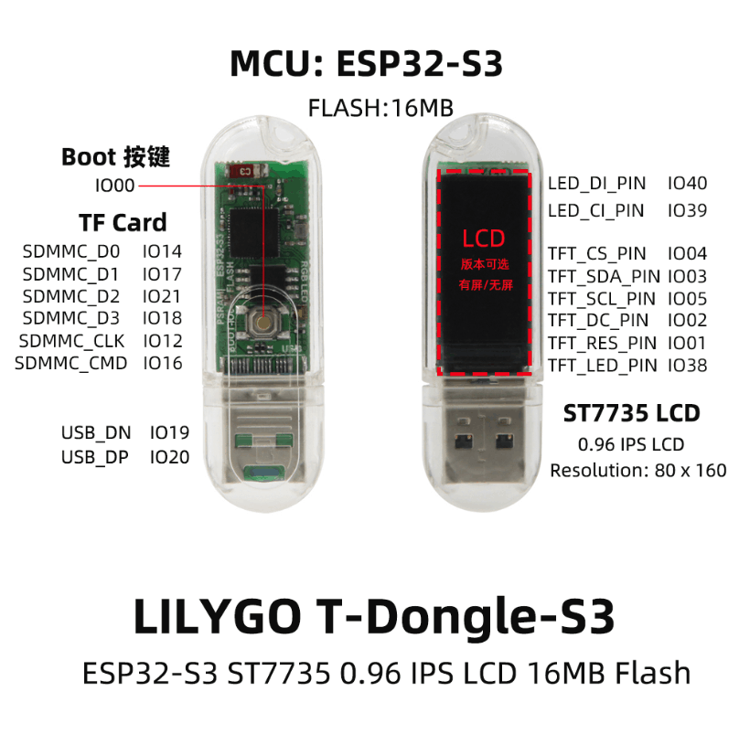

# "Hello world" program for the T-Dongle-S3

Simple project to demonstrate the use of [LilyGo T-Dongle-S3](https://github.com/Xinyuan-LilyGO/T-Dongle-S3).

This is built on an old project because the old code stopped working, so this is the new new T dongle s3 fork AUG 2025

It uses:

* The TFT Display
* The Multicolor LED
* The Serial Port
* The Button

After compiling and uploading the project, the TFT screen will cycle though showing "Red", "Green" and "Blue". The multicolour led will also iluminate with the corresponding colour. If you press and hold the button on the back of the dongle, the screen will turn yellow and the TFT and led will also act accordingly. The colour being shown is always written to the serial port.

As a plus, the handler for the button is installed as a separate task in the ESP32S3 processor.

## How to compile and run

Requirements:

* Make sure that you have [Visual Studio Code](https://code.visualstudio.com) installed
* Make sure that you have [Platform IO](https://platformio.org) installed
* Make sure you have [Espressif IDF](https://github.com/espressif/vscode-esp-idf-extension) extension installed

If you have all these installed, simply open the project in PlatformIO, hit the "build" and "upload" buttons.
